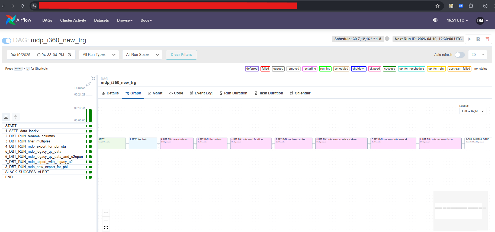

# Marketing Development Program (MDP) - Data Pipeline

## 1. Problem Statement

### Current Challenges

The Marketing Development Program (MDP) operates across a complex partner ecosystem including VARs (Value-Added Resellers) and VADs (Value-Added Distributors) in multiple geographies, generating substantial volumes of marketing activity data. The organization faced the following critical issues:

- **Fragmented Data Sources**: Marketing activity data, budget allocations, partner performance metrics, and proof-of-performance (POP) data were scattered across multiple systems with no centralized repository
- **Manual Reporting**: Weekly and historical reporting required extensive manual compilation, consolidation, and validation processes, creating delays and increasing error rates
- **Lack of Real-Time Visibility**: Stakeholders lacked real-time visibility into marketing investment ROI, partner engagement levels, and campaign effectiveness metrics
- **Compliance & Audit Gaps**: Proof of performance data wasn't consistently tracked, making it difficult to validate partner claims and ensure program compliance
- **Decision-Making Delays**: Business decisions on budget allocation, partner enablement, and strategic investments were delayed due to non-automated reporting cycles
- **Data Quality Issues**: No standardized data validation or quality checks, leading to inconsistent metrics and unreliable insights

---

## 2. Business Use-Case

### Program Overview

The **Marketing Development Program (MDP)** is a structured initiative designed to support and fund marketing activities executed by channel partners. It typically falls under a broader Channel Development Program (CDP), which may also include other sub-programs like Strategic Investment Programs (SIP) and enablement initiatives.

### Key Business Objectives

1. **Partner Marketing Funding & Enablement**
   - Provide financial support to channel partners (VARs, VADs) for executing approved marketing campaigns
   - Improve partner capability in executing customer-facing marketing activities
   - Expand market reach through partner-led marketing initiatives

2. **Marketing Performance Tracking**
   - Monitor partner compliance with program requirements
   - Track campaign effectiveness metrics (reach, engagement, ROI)
   - Validate partner-reported results through proof-of-performance (POP)

3. **Budget Optimization**
   - Allocate budgets based on country/territory tier and partner performance
   - Track quarterly and year-over-year budget spend and variances
   - Ensure ROI on marketing investments

4. **Strategic Alignment**
   - Align partner marketing activities with corporate growth objectives
   - Foster transparency in marketing spend and effectiveness
   - Enable data-driven decisions on partner investment levels

### Eligible Marketing Activities

- Digital campaigns and online advertising
- Webinars and virtual events
- Direct marketing initiatives
- Telemarketing outreach
- Content localization and development
- In-person events and trade shows

---

## 3. Who Uses It? (Stakeholders)

### Primary User Groups

| Stakeholder | Role | Key Needs |
|---|---|---|
| **Marketing Team (Corporate)** | Program management, partner enablement, campaign oversight | Real-time dashboards for partner activity, compliance tracking, ROI analysis |
| **Finance Team** | Budget management, forecasting, cost optimization | Budget tracking, spend vs. allocation reports, quarterly and year-over-year analysis |
| **Channel Management** | Partner relationship management, performance evaluation | Partner engagement metrics, performance summaries, investment justification |
| **Executive Leadership** | Strategic decision-making, investment planning | High-level performance summaries, ROI trends, partner tier performance |
| **Data & Analytics Team** | Data pipeline management, reporting infrastructure | Raw data access, standardized metrics definitions, data quality assurance |
| **Partner Account Managers** | Day-to-day partner engagement, activity approvals | Activity approval workflows, funding availability, partner performance feedback |
| **Compliance & Audit** | Program governance, audit trails, regulatory reporting | Proof-of-performance documentation, audit trails, compliance validation |

---

## 4. Expected Outcomes

### Faster Reporting

- **Automated Weekly Reporting**: Weekly performance dashboards generated automatically instead of manual compilation
- **Real-Time Dashboards**: 24-hour data latency (weekly updates) vs. previously manual monthly/quarterly reporting
- **Reduced Report Generation Time**: From 2-3 days manual work to <1 hour automated pipeline execution
- **Self-Service Analytics**: Stakeholders can access reports on-demand rather than waiting for manual creation

### Cost Optimization

- **Improved Budget Allocation**: Data-driven insights into which partner tiers and geographies deliver best ROI
- **Waste Reduction**: Identify underperforming activities and redirect budgets to high-impact initiatives
- **Partner Performance Tiering**: Segment partners by performance to optimize investment distribution
- **Benchmark Analysis**: Compare partner performance across regions to identify best practices and optimize spending

### Better Decision-Making

- **Transparent ROI Tracking**: Clear visibility into marketing investment returns by partner, region, and activity type
- **Actionable Insights**: Identify top-performing partners, successful campaign types, and underutilized opportunities
- **Compliance Assurance**: Proof-of-performance validation reduces audit risk and ensures regulatory compliance
- **Strategic Planning**: Evidence-based decisions on which partners to invest in, which markets to expand, and which activity types to prioritize
- **Forecasting Accuracy**: Historical data enables more accurate budget forecasting and quarterly/annual planning

### Additional Benefits

- **Partner Satisfaction**: Timely feedback on funding and performance improves partner relationships
- **Program Scalability**: Automated infrastructure allows the program to scale across more partners and geographies
- **Data Consistency**: Standardized data definitions and validation rules ensure reliable metrics across the organization

---

## 5. Architecture Diagram


### Architecture Overview

The data pipeline follows a multi-layered architecture designed for scalability, reliability, and performance:

#### **Data Ingestion Layer** (Left Side)
- **SFTP**: Secure file transfer protocol for structured data uploads
- **CCI Scorecard**: Partner performance metrics and scorecard data
- **COI/ROI Report**: Financial reporting and ROI data sources
- Data flows into **AWS S3 Buckets** for temporary staging and buffering

#### **Processing & Transformation Layer** (Middle Left)
- **Using Python ingest data**: Custom Python scripts for data validation and transformation
- **Apache Airflow (Astronomer)**: Workflow orchestration and scheduling
- Manages data flow through multiple Snowflake instances:
  - **ETL_SCHEMA_I360**: Partner dimension, product hierarchy, and master data
  - **ETL_SCHEMA_E2OPEN**: Supply chain, operations, and external partner data
  - **ETL_SCHEMA_LEGACY**: Historical and legacy system data for backward compatibility

#### **Data Consolidation & Analytics Layer** (Middle Right)
- **UNION ALL DATA**: Consolidates data from all ETL schemas into a single unified dataset
- **SQL Transformation using dbt**: Advanced business logic, metric calculations, and data quality checks

#### **Output & Visualization Layer** (Right Side)
- **PROD_SCHEMA_360L_EXPORT_FOR_PBI**: Production-ready analytics tables optimized for BI tools
- **Dashboard**: Final Power BI/Looker dashboards for executive and operational stakeholders
- Real-time visibility into partner performance, budget utilization, campaign ROI, and compliance metrics

---



## 6. Tech Stack Justification

### Selected Technologies & Rationale

#### **Snowflake (Data Warehouse)**

| Aspect | Justification |
|---|---|
| **Why Snowflake?** | Enterprise-grade cloud data warehouse with native Python support, strong analytics performance, and excellent Snowflake-dbt integration |
| **Key Benefits** | • Automatic scaling for variable workloads<br>• Time-travel capability for debugging and auditing<br>• Native support for semi-structured data (JSON)<br>• Cost optimization through compute separation<br>• Role-based access control for data governance |
| **Use Case Fit** | Retail marketing data involves partner profiles, campaign metrics, and proof-of-performance records that benefit from Snowflake's structured + semi-structured capabilities |
| **Scalability** | Easily handles growth from current partner base to 100s of partners across 50+ countries |

#### **Python (Data Processing & APIs)**

| Aspect | Justification |
|---|---|
| **Why Python?** | Rich ecosystem for data manipulation (Pandas), API integrations (Requests), and orchestration |
| **Key Benefits** | • dbt integration via dbt-core with Python runners<br>• Excellent for ETL and data quality validation<br>• Easy integration with Salesforce, Finance APIs<br>• Strong community support and libraries<br>• Well-suited for Airflow DAG development |
| **Use Case Fit** | Custom transformations for partner eligibility rules, ROI calculations, and POP validation logic |

#### **dbt (Data Transformation)**

| Aspect | Justification |
|---|---|
| **Why dbt?** | Industry-standard ELT tool for analytics engineering, with built-in testing and documentation |
| **Key Benefits** | • SQL-based transformations (easy for analysts)<br>• Automated testing framework for data quality<br>• Built-in lineage tracking (data governance)<br>• Git-based version control for reproducibility<br>• Excellent Snowflake integration<br>• dbt docs auto-generates data dictionary |
| **Use Case Fit** | Transforms raw partner data into business metrics (ROI, engagement scores, compliance status) |
| **Maintainability** | SQL-based approach allows analysts to contribute without Python expertise |

#### **Apache Airflow**

| Aspect | Justification |
|---|---|
| **Why Airflow?** | Open-source standard for workflow orchestration with native AWS integration via MWAA |
| **Key Benefits** | • Python-based DAG definitions (Infrastructure as Code)<br>• Excellent monitoring and error handling<br>• Native AWS service integration (S3, Snowflake, SageMaker)<br>• Cost-effective managed service through MWAA<br>• Rich ecosystem of operators and plugins<br>• Comprehensive audit logs |
| **Use Case Fit** | Orchestrates weekly data ingestion, dbt transformations, and reporting refresh cycles |
| **Alternatives Considered** | Lambda (stateless, limited for complex workflows), Step Functions (lower flexibility), Matillion (higher cost) |

#### **AWS Services (Cloud Infrastructure)**

| Service | Purpose | Justification |
|---|---|---|
| **S3** | Data Lake (raw data staging) | Cost-effective, durable, integrates with all tools, versioning support |
| **IAM** | Access Control & Security | Fine-grained permissions, audit logging, compliance |
| **CloudWatch** | Monitoring & Logging | Pipeline execution tracking, alerting, cost analysis |
| **SNS / SQS** | Notifications | Pipeline failure alerts, event-driven architecture |

#### **Why NOT Other Options?**

| Considered | Why Not Selected |
|---|---|
| **BigQuery** | While good for analytics, Snowflake's cost predictability and semi-structured data handling better fit retail partner data |
| **Redshift** | Older columnar store, less flexibility than Snowflake, higher operational overhead |
| **Matillion** | GUI-based tool with higher licensing costs; dbt+Airflow combination offers more flexibility |
| **Talend / Informatica** | Legacy ETL tools with higher TCO and steeper learning curves |
| **Kubernetes-based Airflow** | MWAA reduces operational complexity; own k8s deployment requires DevOps expertise |
| **Google Cloud / Azure** | AWS has deeper dbt + Airflow ecosystem; Snowflake on AWS offers best performance |

### Technology Architecture Benefits

✅ **Scalability**: Handles current and future data volume growth (from partner portals and additional geographies)

✅ **Cost Efficiency**: Pay-as-you-go pricing model; dbt and Python are open-source

✅ **Maintainability**: SQL-based transformations allow data analysts (not just engineers) to contribute

✅ **Data Governance**: Built-in lineage tracking (dbt), audit logs (AWS CloudTrail), and access control (IAM)

✅ **Compliance**: Snowflake's encryption, time-travel, and audit capabilities support regulatory requirements

✅ **Performance**: Weekly data refresh cycle meets business SLA; Snowflake optimized for complex analytical queries

✅ **Team Productivity**: Industry-standard tools with abundant documentation and community support

---

## 7. Data Model Overview

### Key Entities

```
Partner
  ├─ partner_id (PK)
  ├─ partner_name
  ├─ partner_type (VAR, VAD, etc.)
  ├─ country
  ├─ tier (Platinum, Gold, Silver)
  └─ active_flag

Marketing Activity
  ├─ activity_id (PK)
  ├─ partner_id (FK)
  ├─ activity_type (Digital Campaign, Webinar, etc.)
  ├─ approval_status
  ├─ approved_budget
  ├─ start_date
  ├─ end_date
  └─ created_date

Proof of Performance
  ├─ pop_id (PK)
  ├─ activity_id (FK)
  ├─ partner_reported_results
  ├─ metrics (reach, engagement, leads, etc.)
  ├─ validation_status
  ├─ actual_budget_spent
  └─ report_date

Budget Allocation
  ├─ budget_id (PK)
  ├─ partner_id (FK)
  ├─ country
  ├─ period (Quarter, Year)
  ├─ allocated_budget
  ├─ spend_to_date
  ├─ variance
  └─ effective_date
```

### Key Metrics (KPIs)

- **Budget Utilization Rate**: (Actual Spend / Allocated Budget) %
- **Partner Engagement Score**: Weighted activity and compliance metrics
- **Campaign ROI**: (Lead Value / Budget Spent)
- **Approval Rate**: (Approved Activities / Submitted Activities) %
- **Compliance Rate**: (POP-Validated Activities / Total Activities) %
- **Tier Performance**: Revenue contributed by each partner tier

---

## 8. Development & Deployment

### Getting Started

```bash
# Clone the repository
git clone <repository-url>
cd mdp-data-pipeline

# Create virtual environment
python -m venv venv
source venv/bin/activate  # On Windows: venv\Scripts\activate

# Install dependencies
pip install -r requirements.txt
dbt deps

# Configure Snowflake credentials
# Update profiles.yml with your connection details

# Run dbt models locally for testing
dbt run --select tag:daily

# Deploy to production
# Code is deployed via CI/CD pipeline on merge to main branch
```

### Repository Structure

```
mdp-data-pipeline/
├── dbt/
│   ├── models/
│   │   ├── staging/        # Raw data staging models
│   │   ├── intermediate/   # Business logic transformations
│   │   └── marts/          # Final analytical tables
│   ├── tests/              # Data quality tests
│   ├── macros/             # Reusable SQL logic
│   └── dbt_project.yml
├── airflow/
│   ├── dags/               # Airflow DAG definitions
│   │   ├── mdp_weekly_pipeline.py
│   │   └── data_quality_checks.py
│   └── plugins/
├── python/
│   ├── src/
│   │   ├── api_clients/    # Partner portal, Salesforce APIs
│   │   ├── validators/     # Data validation logic
│   │   └── utils/          # Helper functions
│   └── tests/
├── sql/
│   ├── queries/            # Ad-hoc analysis queries
│   └── migrations/         # Schema changes
├── config/
│   ├── aws_config.yaml
│   ├── snowflake_config.yaml
│   └── dbt_profiles.yml
├── docs/
│   ├── architecture.md
│   ├── data_dictionary.md
│   └── runbook.md
└── README.md
```

---

## 9. Monitoring & Support

### Key Dashboards

1. **Pipeline Health Dashboard** (Airflow UI)
   - DAG success/failure rates
   - Task execution times
   - Data freshness metrics

2. **Data Quality Dashboard** (Snowflake)
   - dbt test pass rates
   - Data completeness by table
   - Schema drift alerts

3. **Business KPI Dashboard** (Power BI)
   - Weekly partner activity summary
   - Budget vs. spend variance
   - ROI by partner and region

### Alerting

- Pipeline failures trigger SNS notifications to Data Engineering team
- Data quality test failures create Jira tickets
- SLA breaches (missing weekly refresh) escalate to Data Lead

### Support & Documentation

- **dbt Docs**: Auto-generated data dictionary accessible via `dbt docs generate`
- **Runbook**: Step-by-step troubleshooting guide for common issues
- **Contact**: Data Strategy team - <data-team@company.com>

---

## 10. Future Roadmap

### Phase 2 (Q3-Q4 2026)
- **Real-time Dashboards**: Transition from weekly to daily/near-real-time refresh
- **Predictive Analytics**: ML models for partner performance forecasting
- **Expanded Scope**: Integrate additional Channel Development Program sub-programs (SIP, enablement)

### Phase 3 (2027+)
- **Advanced Analytics**: Customer attribution models, marketing mix modeling
- **Self-Service**: Partner-facing analytics portal for self-service reporting
- **Cost Optimization**: Automated budget recommendations based on ROI trends

---

## 11. Contact & References

- **Data Engineering Lead**: [Contact Information]
- **Project Documentation**: [Confluence/SharePoint Link]
- **Slack Channel**: #mdp-data-pipeline
- **Related Confluence Pages**:
  - MDP Program Overview
  - Dashboard Sections & Definitions
  - Investment Summary Documentation
  - Partner Engagement Metrics

---

**Last Updated**: April 2026  
**Document Version**: 1.0  
**Owner**: Data Strategy & Analytics Team
